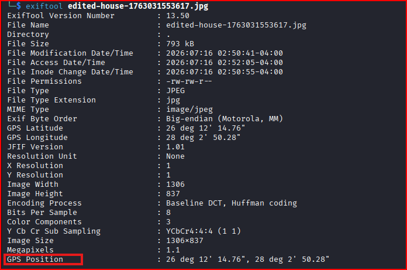
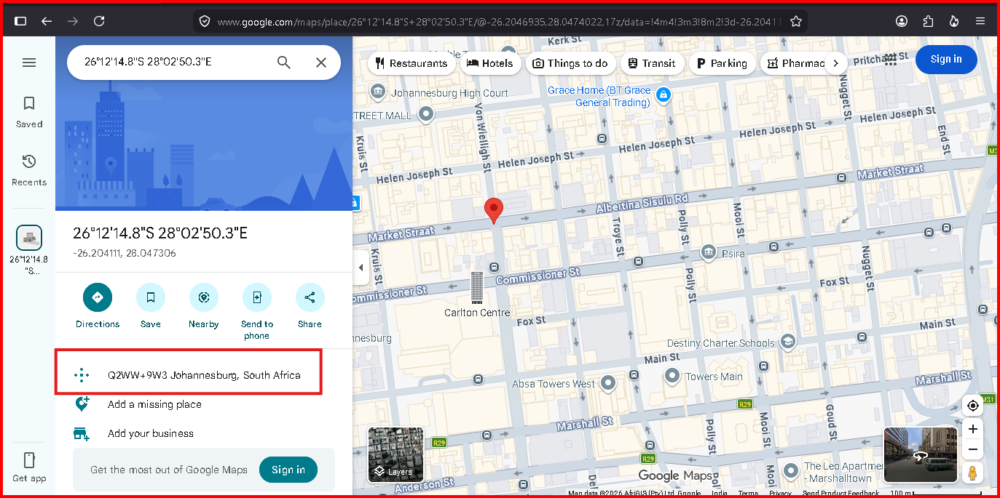
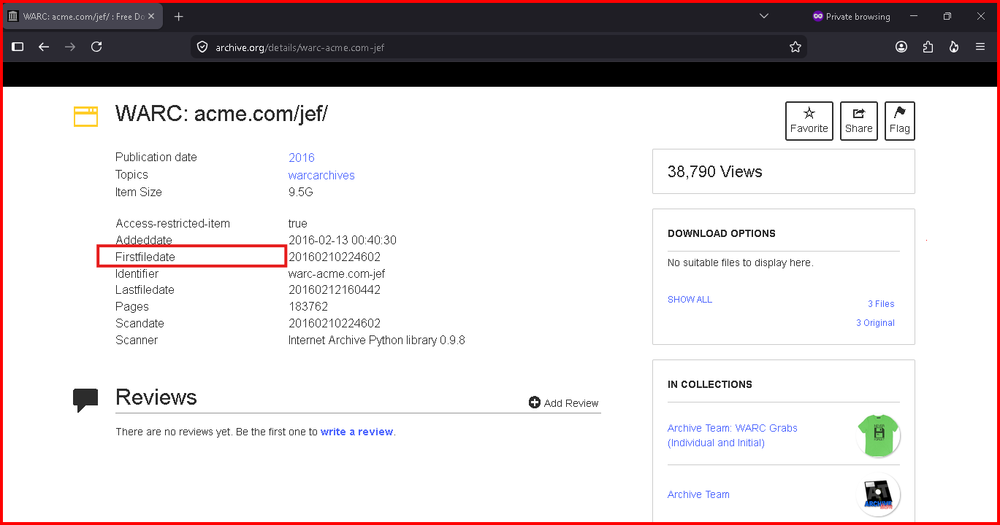
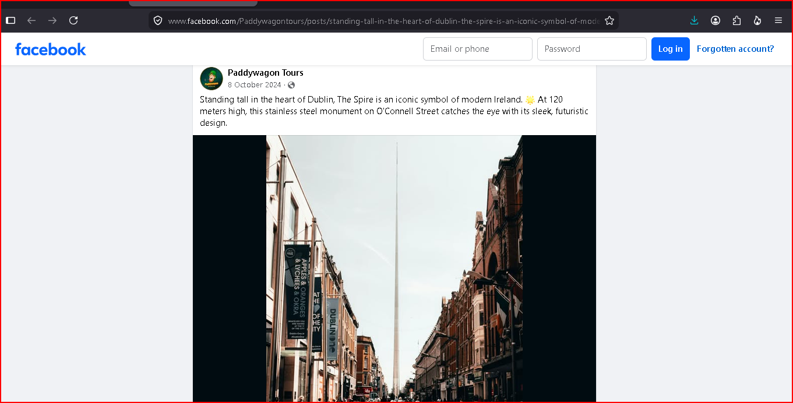
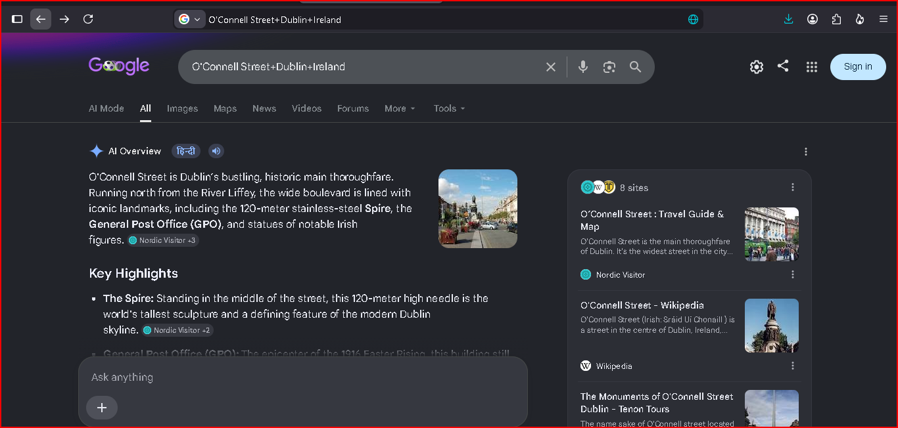
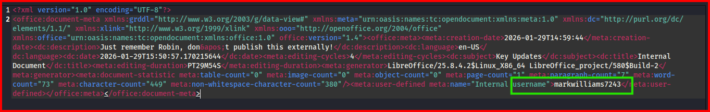
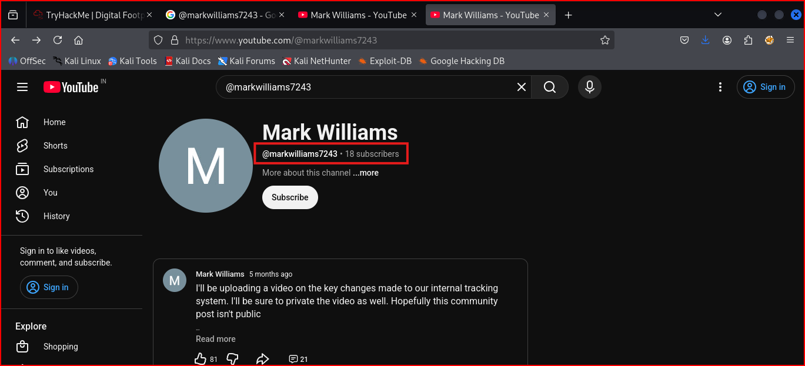

<<<<<<< HEAD
# Digital Footprint

- **URL:** https://tryhackme.com/room/osintchallengeiv
- **Category:** OSINT
- **Techniques Applied:** Metadata Analysis, Geolocation

## 🎯 Objective
To perform a comprehensive investigation into "ACME Jet Solutions" by validating founding claims and uncovering leaked internal data. The investigation utilizes metadata analysis, web archiving, geolocation, and document forensics.

## 🛠 Tools Used
- observational skills
- `exiftool` (Metadata analysis)
- Wayback Machine / Internet Archive (Web history)
- Google Search / Google Maps (Geolocation)
- LibreOffice / `unzip` (Document forensics)

---

## 🚀 Methodology

### Task 1: The Leaked Photo
**Goal:** Geolocate a residential property photo.
1. Ran `exiftool` on the image file to extract EXIF data.
****
2. Identified GPS coordinates: `26 deg 12' 14.76" S, 28 deg 2' 50.28" E`.
3. Used Google Maps/Coordinates conversion or google AI Mode to pinpoint the location in **Johannesburg, South Africa**.
****

### Task 2: Archived Company Website
**Goal:** Determine the actual website founding date.
1. Searched the [Wayback Machine](https://web.archive.org/) for `warc-acme.com`.
2. Investigated subdirectories, eventually finding the company's first web presence via the [Internet Archive](https://archive.org/).
****

### Task 3: Mysterious Landmark
**Goal:** Identify a landmark near a specific building.
1. Analyzed the provided image and performed reverse image/keyword searches for 'AT THE heart-symbol OF THE CITY, DUBLINONE'.
****
2. Confirmed the landmark's location on O'Connell Street.
****
3. Used Google Search "O'Connell Street+Dublin+Ireland" to identify the nearby historic building associated with the independence movement: **General Post Office (GPO)**.
****

### Task 4: Internal Documents
**Goal:** Extract hidden information from a leaked `.odt` file.
1. Recognized the `.odt` file as a ZIP archive.
2. Renamed the file to `.zip` and used `unzip` to extract the contents.
3. Inspected the `meta.xml` file to uncover the username: `markwilliams7243`.
****
4. Performed a targeted search for the username on YouTube to locate the final flag.
****

---

## 💡 Key Lessons
- **Metadata Matters:** Always check EXIF data in image-based OSINT challenges.
- **File Forensics:** Document formats like `.odt`, `.docx`, and `.xlsx` are essentially ZIP archives; they can be unpacked to reveal internal metadata and hidden files.
- **Persistence:** When a search for a specific URL fails, search the root domain or utilize the broader Internet Archive database.

---
*Back to [README](../../README.md)*
=======
# Digital Footprint

- **URL:** https://tryhackme.com/room/osintchallengeiv
- **Category:** OSINT
- **Techniques Applied:** Metadata Analysis, Geolocation

## 🎯 Objective
To perform a comprehensive investigation into "ACME Jet Solutions" by validating founding claims and uncovering leaked internal data. The investigation utilizes metadata analysis, web archiving, geolocation, and document forensics.

## 🛠 Tools Used
- observational skills
- `exiftool` (Metadata analysis)
- Wayback Machine / Internet Archive (Web history)
- Google Search / Google Maps (Geolocation)
- LibreOffice / `unzip` (Document forensics)

---

## 🚀 Methodology

### Task 1: The Leaked Photo
**Goal:** Geolocate a residential property photo.
1. Ran `exiftool` on the image file to extract EXIF data.
****
2. Identified GPS coordinates: `26 deg 12' 14.76" S, 28 deg 2' 50.28" E`.
3. Used Google Maps/Coordinates conversion or google AI Mode to pinpoint the location in **Johannesburg, South Africa**.
****

### Task 2: Archived Company Website
**Goal:** Determine the actual website founding date.
1. Searched the [Wayback Machine](https://web.archive.org/) for `warc-acme.com`.
2. Investigated subdirectories, eventually finding the company's first web presence via the [Internet Archive](https://archive.org/).
****

### Task 3: Mysterious Landmark
**Goal:** Identify a landmark near a specific building.
1. Analyzed the provided image and performed reverse image/keyword searches for 'AT THE heart-symbol OF THE CITY, DUBLINONE'.
****
2. Confirmed the landmark's location on O'Connell Street.
****
3. Used Google Search "O'Connell Street+Dublin+Ireland" to identify the nearby historic building associated with the independence movement: **General Post Office (GPO)**.
****

### Task 4: Internal Documents
**Goal:** Extract hidden information from a leaked `.odt` file.
1. Recognized the `.odt` file as a ZIP archive.
2. Renamed the file to `.zip` and used `unzip` to extract the contents.
3. Inspected the `meta.xml` file to uncover the username: `markwilliams7243`.
****
4. Performed a targeted search for the username on YouTube to locate the final flag.
****

---

## 💡 Key Lessons
- **Metadata Matters:** Always check EXIF data in image-based OSINT challenges.
- **File Forensics:** Document formats like `.odt`, `.docx`, and `.xlsx` are essentially ZIP archives; they can be unpacked to reveal internal metadata and hidden files.
- **Persistence:** When a search for a specific URL fails, search the root domain or utilize the broader Internet Archive database.

---
*Back to [README](../../README.md)*
>>>>>>> 5ac20217e8da52cc9a66255f218270ca18d2a769
